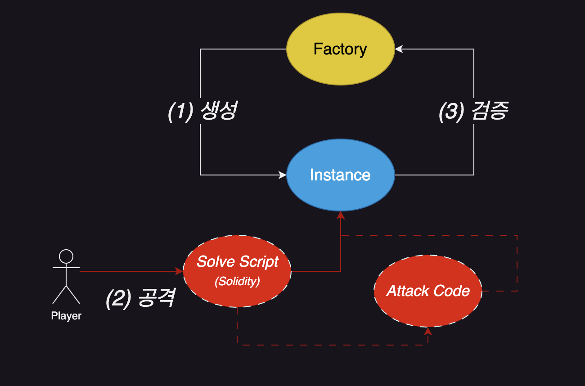
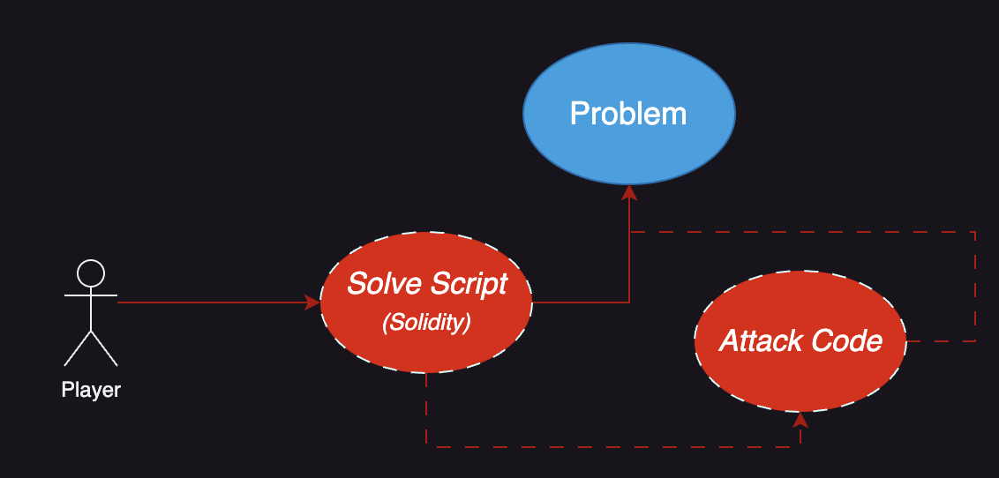
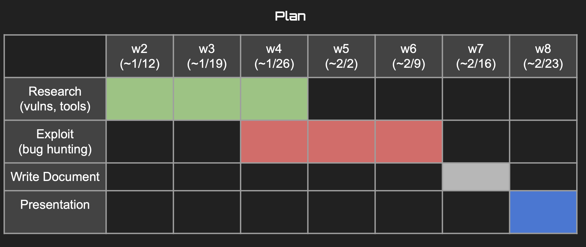

# 기술문서 중간발표

#### 2023 KEEPER Technical Research Paper

---

# Table Of Contents

- 블록체인 취약점들 (1)
    - `Improper Input Validation`
    - `Incorrect Calculation`
    - `Oracle/Price Manipulation`
    - `Weak Access Control`
    - `Replay Attack/Signature Malleability`

- 블록체인 취약점들 (2)
    - `Rounding Error`
    - `Reentrancy`
    - `Front-Running`
    - `Uninitialized Proxy`
    - `Governance Attacks`
- ETC
    - `Tool: Foundry`

---

<header>(1) Improper Input Validation</header>

##### 정의
- 입력값을 제대로 넣지 않아서 발생하는 문제
- `smart contract` 로의 입력값은 항상 `검증`을 해주는 것이 중요함
  - ***Type***, ***Boundary*** 검사
  - 유저의 입력값에 대한 ***정제(sanitize)***
##### 관련 도구, 기술
- `Fuzzing`, `Symbolic Execution` 등으로 다양한 **입력값**을 테스트 해볼 수 있다.
##### 참고 사례
- [Pancakeswap Logic Error Bug](https://medium.com/immunefi/pancakeswap-logic-error-bug-fix-postmortem-f2d02adb6983)
- [Aurora Protocol, Lack of Input Sanitization](https://medium.com/immunefi/aurora-improper-input-sanitization-bugfix-review-a9376dac046f)

---

<header>(2) Incorrect Calculation</header>

##### 정의
- 수식 계산에 정밀함이 떨어진 경우 발생
- precision 및 값 범위(range) 그리고 수식 계산 구현에 더욱 주의해야함
##### 관련 도구, 기술
- `Fuzzing`, `Symbolic Execution` 등으로 놓칠 수 있는 엣지 케이스를 테스트 해볼 수 있음
- **검증된 수학 라이브러리**를 사용하여 *over/under-flow* 문제를 방지할 수 있음

##### 참고 사례
- [Tidal Finance Logic Error Bug](https://medium.com/immunefi/tidal-finance-logic-error-bug-fix-postmortem-3607d8b7ed1f)
- [Polygon Consensus Bypass Bug](https://medium.com/immunefi/polygon-consensus-bypass-bugfix-review-7076ce5047fe)

---

<header>(3) Oracle/Price Manipulation</header>

##### 정의
- **탈중앙화** 되어있는 블록체인의 특성상, 가끔은 <u>중앙화</u>되어있는 정보 제공자 `Oracle` 정보가 필요하다.
  - 다수의 **DeFi** 서비스들이 이러한 `Oracle`에서 제공하는 `가격 정보`들에 의존한다.
- 따라서, `Oracle` 서버의 취약점은 곧 `DeFi` 서비스의 취약점으로 직결된다.
##### 관련 도구, 기술
- `Oracle` 에 대한 보안은 `서버 보안`에 대한 고려와 동일

##### 참고 사례
- [BonqDAO oracle price manipulation](https://medium.com/immunefi/hack-analysis-bonqdao-february-2023-ef6aab0086d6)

---

<header>(4) Weak Access Control</header>

##### 정의
- **돈** 과 직결되는 `Smart Contract` 의 동작들은 <u>허가된 사용자</u> 판단 여부가 중요하다.
- 따라서, 개발자는 `Role-based` `access control mechanism`을 구현해야 한다.

##### 관련 도구, 기술
- `Solidity`의 `modifier` 중 *onlyOwner* 와 같이 `Role-based` 구현을 한다.

##### 참고 사례
- [openZeppelin `TimelockControl` smart contract](https://medium.com/immunefi/openzeppelin-bug-fix-postmortem-66d8c89ed166)

---

<header>(5) Replay Attack/Signature Malleability</header>

##### 정의
- 블록체인의 핵심 기술인 `암호학` 은 `transaction` 을 `검증`하는 데에도 활용된다.
- 해커는 `검증된 transaction` 등을 악용하여 `Replay Attack` 을 시도할 수 있다.

##### 관련 도구, 기술
- `Nonce-based` 로 입력값(tx 등)을 처리를 할 수 있게 해야한다.

##### 참고 사례
- [openZeppelin `TimelockControl` smart contract](https://medium.com/immunefi/openzeppelin-bug-fix-postmortem-66d8c89ed166)

---

<header>(6) Rounding Error</header>

##### 정의
- **Floating-point** 에 대한 계산은 `Web3`에서 특히 중요하다.
- 실제 **돈** 이 오가는 프로그램이기 때문이다.

##### 관련 도구, 기술
- 검증된 `라이브러리` 를 사용해 구현하는 것을 권장한다.
- 또한, 다수의 `테스트` 를 통해 취약점을 사전에 방지하는 것이 중요하다.

##### 참고 사례
- [Moonbeam, Asatar, and Acala Library Truncation (`256bits to 128bits`) Bug](https://medium.com/immunefi/openzeppelin-bug-fix-postmortem-66d8c89ed166)

---

<header>(7) Reentrancy</header>

##### 정의
- `Smart Contract` 를 호출하여 함수를 실행하던 중 `재진입`하는 공격 방식
- 만약 *출금* 로직 직후 `재진입`이 가능하다면, `무한 출금`이 가능할 수도 있음

##### 관련 도구, 기술
- `Checks-Effects-Interactions (CEI)` 디자인 패턴에 따라 `SC`를 구현한다.
- `Mutex Lock` 또는 *openZeppelin* 에서 구현한 `ReentrancyGuard` 와 같은 방법들을 활용한다.

##### 참고 사례
- [Omni Protocol, Reentrancy](https://medium.com/immunefi/hack-analysis-omni-protocol-july-2022-2d35091a0109)

---

<header>(8) Front-Running</header>

##### 정의
- `Transaction` 은 `전송` 직후 **블록**에 들어가기 까지 `대기` 상태에 머물게 된다. (`Tx Pool`)
- 누구나 `Tx Pool`을 볼 수 있으므로, 자신의 `Tx'`가 먼저 **블록**에 들어갈 수 있도록 `가스비`, `입력 데이터` 등을 설정해서 `전송`할 수 있다.
- 만약 **높은 가치의 NFT** 를 발행하는 경우, 타인보다 *소량의 가스비를 더 내고* **NFT** 를 먼저 발급받는 것이 가능하다.

##### 관련 도구, 기술
- `디자인 패턴`: `SC`구현 시 `가스비` 등 주요 정보는 비밀로 한다는 등
- `기술적 방안`: `Tx Pool` 에서가 아닌 `off-chain` 에서 거래를 처리하는 등

##### 참고 사례
- [RocketPool and Lido Front-running Bug](https://medium.com/immunefi/rocketpool-lido-frontrunning-bug-fix-postmortem-e701f26d7971)

---

<header>(9) Uninitialized Proxy</header>

##### 정의
- 한번 `deploy` 되면 수정할 수 없는 `SC` 를 위해 `Proxy Design Pattern`을 적용할 수 있다.
- 하지만, `Proxy` 가 가리키는 `SC'`를 적절히 **초기화**하지 않으면 취약할 수 있다.
- 이는 `delegateCall`이 `storage`에 접근하는 방식 때문이다.
  - `caller`의 정보를 `callee`의 정보에 덮어버릴 수 있음

##### 관련 도구, 기술
- 개발자가 **초기화** 여부를 체크해야한다.
- `테스트`를 잘 해야한다....

##### 참고 사례
- [Wormhole Uninitialized Proxy Bug](https://medium.com/immunefi/wormhole-uninitialized-proxy-bugfix-review-90250c41a43a)

---

<header>(10) Governance Attack</header>

##### 정의
- `탈중앙화` 되어있는 블록체인 상의 시스템(DAO 등)에서는 `결정권`을 시스템적으로 부여한다.
- 따라서, 해당 `결정권`에 관한 `취약점`이 발견되는 것은 큰 이슈이다..

##### 관련 도구, 기술
- 일반적으로 `거버넌스 토큰`을 발급하여 `투표`의 형태로 진행되므로, 구현 단계에서 `거버넌스`와 관련한 설계를 잘하는 것이 중요하다.
- 거래소에 이러한 `거버넌스 토큰`이 과반수 이상 거래되지 않도록 정책적으로 막는 것도 필요하다.

##### 참고 사례
- [Beanstalk Governance Attack](https://medium.com/immunefi/hack-analysis-beanstalk-governance-attack-april-2022-f42788fc821e) 

---

<header> Foundry: Ethernaut </header>

# Ethernaut 

- `Solidity` 학습
- 기본적인 `취약점` 학습

## `Foundry` 를 이용한 문제 풀이 시 파일 구조
- 각 문제별 `Prob` 폴더
  - `Prob_Factory ctrt`
  - `Prob ctrt`
  - `Attack ctrt` *(optional)*

---

<header> Foundry: Damn Vulnerable Defi </header>

# Damn Vulnerable Defi 

- `DeFi` 서비스에 초점을 맞춘 `취약점` 학습

## `Foundry` 를 이용한 문제 풀이 시 파일 구조
- 각 문제별 `Prob` 폴더
  - `Prob ctrt`
  - `Attack ctrt`

---

<header> 계획 리마인드 </header>

- `w5` 까지 *Ethernaut*, *Damn Vulnerable Defi* 를 모두 풀이
- `Bug Bounty` 중인 프로젝트 분석 시작
  - `Slither`, `Mythril` 등 `분석 도구`도 적극 활용

---

# Q&A