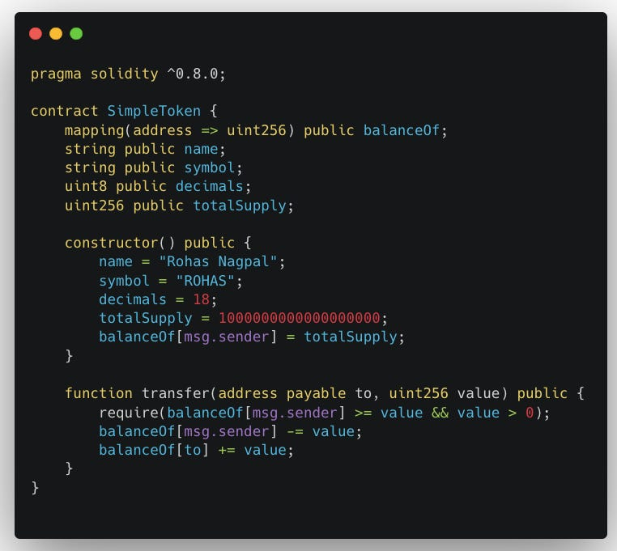
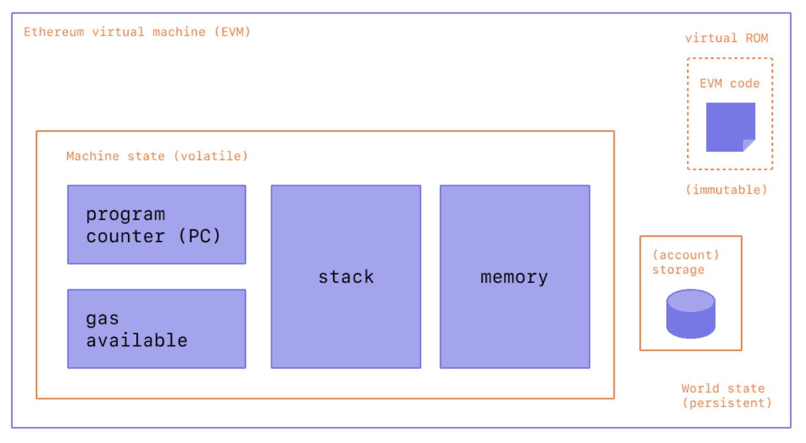
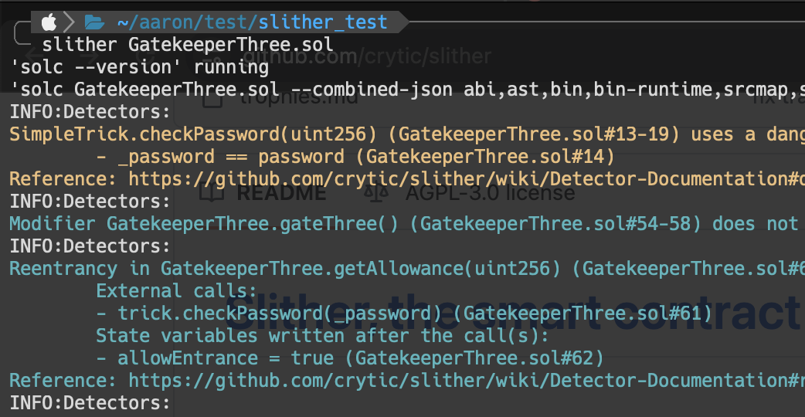
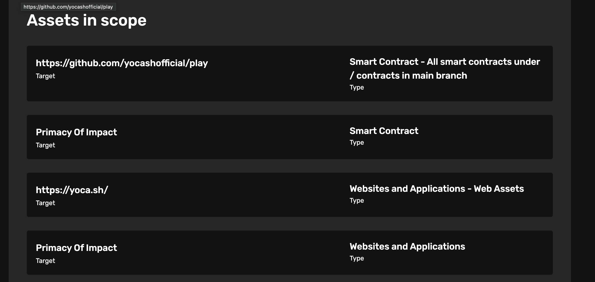
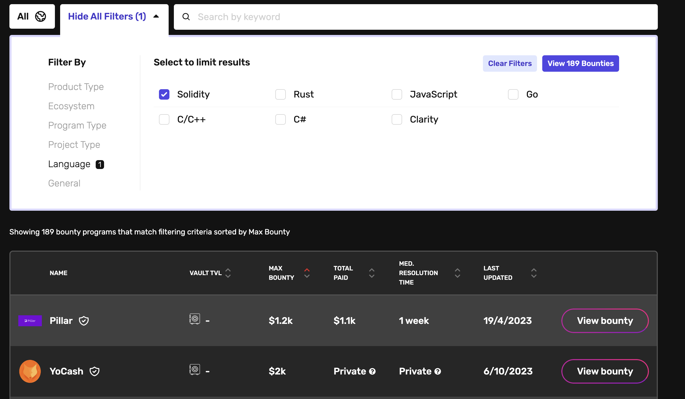
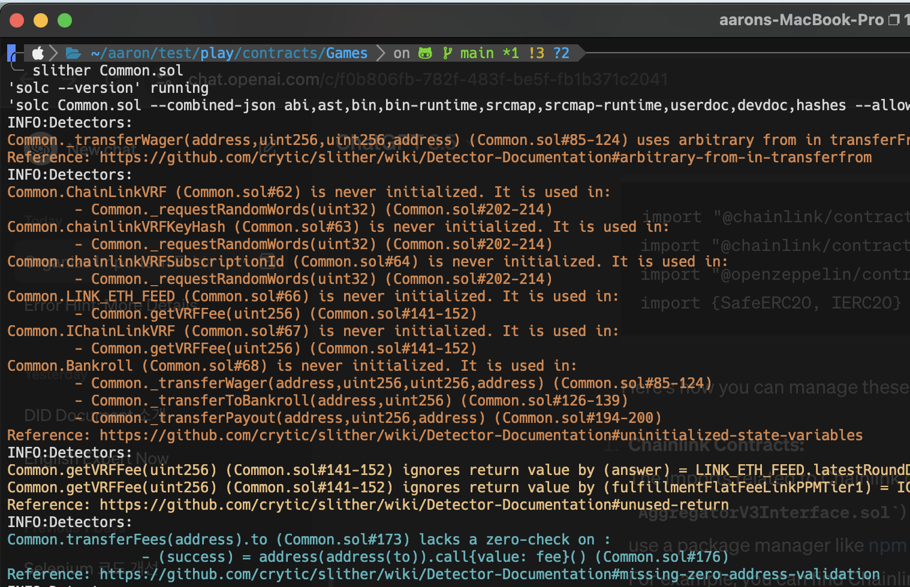

# 기술문서 최종발표

#### 2023 KEEPER Technical Research Paper

---

# 목차

- 공부한 내용
- 기술문서 결과
- 다음 계획

---

<header>공부한 내용</header>

- 블록체인 취약점들

- `Improper Input Validation`
- `Incorrect Calculation`
- `Oracle/Price Manipulation`
- `Weak Access Control`
- `Replay Attack/Signature Malleability`

- `Rounding Error`
- `Reentrancy`
- `Front-Running`
- `Uninitialized Proxy`
- `Governance Attacks`

 

- 취약점 실습

- `Ethernaut`

- `Damn Vulnerable Defi`

 

- 도구

- `Foundry`

---

<header>공부한 내용</header>

## `Ethernaut`, `DVD`
- ⬆ `Solidity` 코드 이해
- 🚨 취약한 코드 패턴 학습
- ✨ 다른 체인에서도 적용 가능

---

<header>공부한 내용</header>

## `EVM 구조, 동작과정`
- ✨ ***EVM*** 에 대한 보다 깊은 이해
- ✨ 블록체인 전반에 대한 이해
- ✨ 다른 체인을 이해할 때도 유리

---

<header>공부한 내용</header>

## `Foundry`
- 🛠️ Ethereum 개발 및 테스팅 도구
- 👍 유용함
    - `forge`: hardhat 처럼 씀
    - `cast`: 온체인과 소통할 때 씀
    - `anvil`: 로컬넷 돌리기

---

<header>공부한 내용</header>

## `Slither`
- 🛠️ `Solidity` 정적 분석 툴

- `slither <contract_code>.sol` 하면 바로 결과 확인됨

---

<header>공부한 내용</header>

---

<header>기술문서 결과</header>

# 원래 목표
- 버그 바운티
    - 아직 못함;
- **구상**
    - [`slither`](https://github.com/crytic/slither) 를 이용해 정적분석으로 취약점 있는지 확인
    - 테스트넷, 로컬넷에서 공격 테스트
    - 문서로 만들어서 바운티 플랫폼에 제출

---

<header>기술문서 결과</header>

## 목표 선정
- 😅 제일 돈 적게 주는 곳

---

<header>기술문서 결과</header>

- 🔥 `Slither` 결과, 뭐가 많이 뜸
- 😆 `Ethernaut` 에서 연습한 공격 기법 적용하면 될 것 같다..

---

<header>다음 계획</header>

- 공격 성공하는거 확인하고, 문서화 한 다음 제출 예정

---

# Thank you
